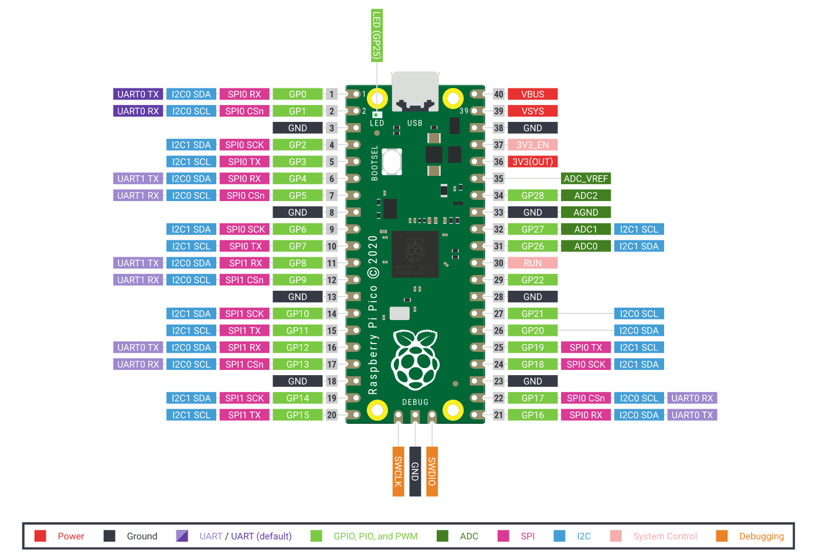

# Basic Raspberry PI Pico Projects

### If you need to know the pin numbers for a Raspberry Pi Pico, you can refer to the following diagram.

 

## Projects
#
### Blink the onboard LED - blink.py
#
### Use digital inputs and outputs - blink-led.py

#### You can learn to control an external LED with your Raspberry Pi Pico, and get it to read input from a button.

